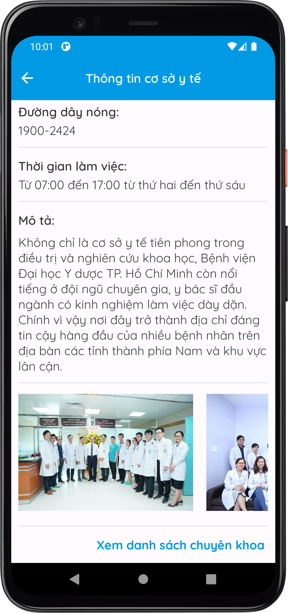

# Clinic Appointment
Android Clinic Appointment Application

## App features
### Patients:
- Making appointments with health facilities or doctors at specified times, along with preview images
- Managing schedules and review medical examination history
- Rating health facilities and doctors
- Searching for health schedules, doctors, and health facilities
- Integrating Zalopay for payment transactions
- Cancelling waiting appointments
### Doctors:
- Approving schedules
- Review medical examination history

## Supported languages
- Vietnamese 

## Screenshots
  
  
  
  
  
  
  

## Technical information
- Database: MongoDB
- Payment: Zalopay SDK
- Web Service Communication: Retrofit Library
- Permissions:
  * Internet
  * Access network state
  * Read media images (API 33+)
  * Read external storage (API 32-)
  * Query all packages
- MinSdk: 21
- TargetSdk: 33

## Authors
- [@ngtienndungg](https://github.com/ngtienndungg)

